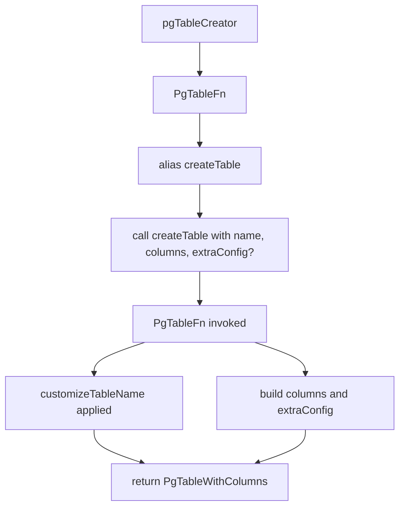

# Learning Drizzle ORM, PG
## pgTableFn

```mermaid
flowchart TD
  A1[pgTableCreator]
  A2[PgTableFn]
  B[alias createTable]
  C[call createTable with name, columns, extraConfig?]
  D[PgTableFn invoked]
  E[customizeTableName applied]
  F[build columns and extraConfig]
  G[return PgTableWithColumns]

  A1 --> A2
  A2 --> B
  B --> C
  C --> D
  D --> E
  D --> F
  E --> G
  F --> G
```